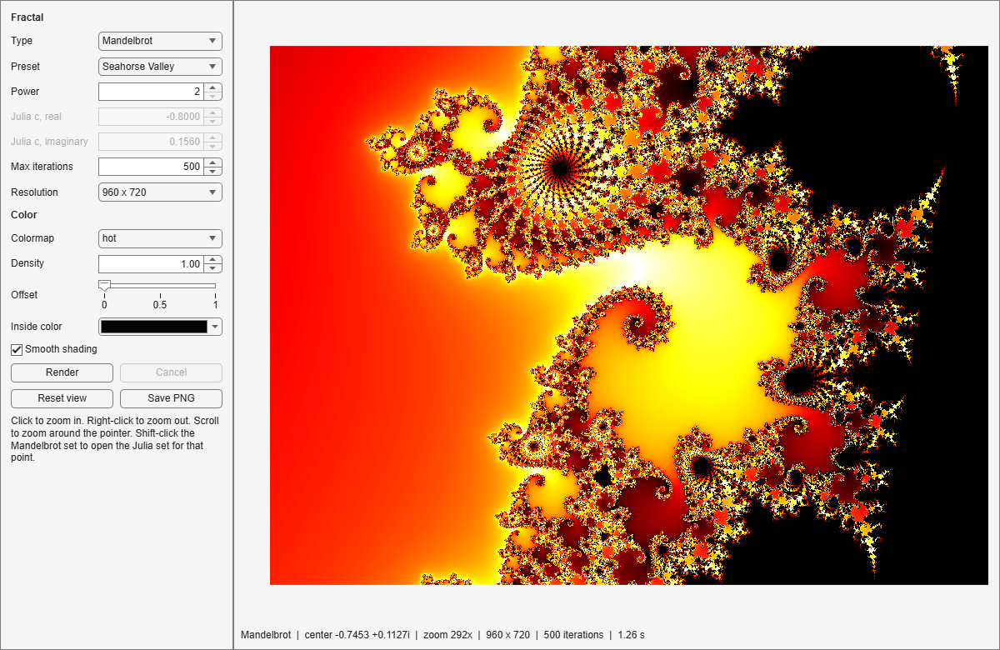

# Fractal App for MATLAB R2026b

Fractal Creator is a MATLAB app for exploring escape-time and Newton fractals and saving them as images.
It is stored in the R2026b plain-text App Designer format.
`FractalCreator.m` holds the code and `FractalCreator.xml` holds the layout, so the app reads cleanly in a diff and still opens in App Designer.

The second half of this README is a step-by-step tutorial on how the app was built.



## Requirements

- MATLAB R2026b or later.
- No additional toolboxes.

## Run

From the repository folder:

```matlab
FractalCreator
```

To edit the layout or code, open `FractalCreator.m` in App Designer.

## Fractals

| Type | Iteration | Parameters |
|---|---|---|
| Mandelbrot | z ← z^p + c, starting at z = 0, c = pixel | power p (2 to 8) |
| Julia | z ← z^p + c, starting at z = pixel | power p, constant c |
| Burning Ship | z ← (\|Re z\| + i\|Im z\|)² + c | none |
| Tricorn | z ← conj(z)² + c | none |
| Newton | z ← z − (z^p − 1) / (p z^(p−1)) | power p (number of roots) |

Escape-time fractals use a smooth escape count with a bailout radius of 256.
Newton colors each pixel by the root it converges to and darkens pixels that converge slowly.

## Controls

- Click to zoom in 2x at the pointer, right-click to zoom out 2x, or scroll to zoom around the pointer.
- Shift-click in the Mandelbrot view to open the Julia set for the point under the pointer.
- Presets jump to known views, including Seahorse Valley, Elephant Valley, a Mandelbrot spiral, a mini Mandelbrot, the Douady rabbit, and the Burning Ship armada.
- Reset view and each type's full-view preset frame the whole set.
  A full view refits when the power or the Julia constant changes.
- Colormap, density, offset, smooth shading, and inside color recolor the current image without recomputing it.
- Save PNG writes the computed pixels exactly, at render resolution, and stores the parameters as JSON in the PNG `Comment` field.
  Read them back with `jsondecode(imfinfo(file).Comment)`.

Scripts and tests drive the same actions through two public methods, `clickImage(point, selectionType)` and `zoomAt(point, factor, keepPointFixed)`, and save images with `exportImage(file)`.

## How rendering works

Each render is split across eight background tasks that run on `backgroundPool` thread workers.
Each task computes an interleaved set of rows, so the expensive rows are spread evenly across the workers.
The app paints rows as they arrive, and the interface stays responsive during long renders.
Changing a parameter cancels the render in progress and starts a new one.
Cancel restores the last finished image.
While a zoomed render computes, the app crops and scales the previous image to the new view as a preview.

Coordinates are double precision, so zoom stops at a view width of about 1e-12.

## Tests

```matlab
results = runtests("tests")
```

- `tests/testRenderFractal.m` checks the render kernel against known points: the Mandelbrot set on the real axis, the unit disk for the Julia set with c = 0, and the roots of z³ − 1 for Newton's method.
  It also checks that splitting a render across tasks reproduces the single-task image exactly, and that each computed full view contains its whole set.
- `tests/FractalCreatorAppTest.m` launches the app and fires the same callbacks a user's clicks fire: zoom, Julia from a Shift-click, presets, full views, Reset view, cancel, recoloring, export, and closing during a render.

## Tutorial, part 1: building the app

A coding agent built the app, working from [MATLAB and Simulink R2026b for Coding Agents](https://mathworks.github.io/releases/R2026b.md).
For app development, that page points to the `matlab-build-app` skill in the [MATLAB Agentic Toolkit](https://github.com/matlab/matlab-agentic-toolkit) and the R2026b plain-text app format.
These are the steps, in the order they happened.

### 1. Confirm the release

Plain-text App Designer apps require R2026b, so the first check was the release of the MATLAB session the agent was driving:

```matlab
r = matlabRelease;
assert(r.Release == "R2026b")
```

### 2. Choose the shape of the app

The `matlab-build-app` skill asks three questions before any code: the architecture, the file format, and the layout.
The answers were a UIFigure app with standard MATLAB components, the App Designer plain-text format, and the Explorer layout, which is a fixed sidebar of controls beside a live display.
The skill writes these decisions to a plan file before building.

### 3. Measure before designing

A vectorized Mandelbrot kernel was timed on one thread before the app existed:

| Size | Iterations | Time |
|---|---|---|
| 800 x 600 | 256 | 0.54 s |
| 1200 x 900 | 500 | 2.77 s |
| 1600 x 1200 | 1000 | 8.54 s |

The skill requires a background task for any operation longer than about one second, so rendering had to run off the main thread.

### 4. Prototype the kernel outside the app

The kernel was checked against points with known answers before it went into the app: c = −1 lies in the Mandelbrot set, c = 0.5 escapes, the Julia set for c = 0 is the unit disk, and Newton's method on z³ − 1 converges to the root nearest a far-out starting point.
Candidate preset views and colormaps were rendered as a contact sheet and selected by visual inspection.
Three candidate views were replaced: one sat mostly inside the set, one was zoomed in too far, and one was off center.

### 5. Generate the app

The skill's `AppDesignerAgentInterface` builds plain-text apps.
`create()` seeds the `.xml`, the component tree is written in the `.xml` using grid layouts only, and code is added through the interface's verbs:

```matlab
appBuilder = AppDesignerAgentInterface.create("FractalCreator.m");
% Write the component tree, layout, and callback wiring in FractalCreator.xml
appBuilder.addBackgroundTask("RenderTask", "Fcn", "renderFractal", ...
    "CompleteFcn", "onRenderComplete", "ProgressFcn", "onRenderProgress");
appBuilder.addMethod("renderFractal", fileread("renderFractal.m"), "static");
appBuilder.setCallbackCode("RenderButtonPushed", "app.requestRender();");
appBuilder.validate();
appBuilder.save();
```

`addBackgroundTask` generates the `parfeval`, `DataQueue`, and cancellation code.
`save()` writes the `.m` and loads the app through App Designer's own loader, so a successful save means the file opens in App Designer.

### 6. Run it and look

On the first launch, the status bar reported 0.47 s for the default view.
Screenshots of each fractal type were inspected visually.
Pressing Cancel freed the background worker: `backgroundPool().Busy` was false immediately afterward.

### 7. Write tests

The kernel tests check known points, as in step 4.
The app tests launch the app, fire component callbacks, and wait for the render with `matlab.unittest.constraints.Eventually`, which processes pending callbacks while it polls.
The test class starts the background pool and loads the kernel on every worker once, before the first app launch.

When these tests drove the app through `matlab.uitest` gestures instead, the R2026b test runner stalled while background renders were in flight.
Firing the callbacks directly avoids the stall, and the suite passed in every repeated run.
Mouse gestures are tested manually.

### 8. Modernize

The toolkit's `matlab-modernize-code` skill runs Code Analyzer first.
It reported no removed or not-recommended functions.
The code was then updated to current conventions: `Name=Value` arguments, string literals, a `table` built from string arrays, and `arguments` blocks on the public methods.

### 9. Open in App Designer

Opening the app in App Designer and saving it rewrites the `.xml` in App Designer's own canonical form.
The only differences were element order, one dropped default value, and Windows line endings.

## Tutorial, part 2: faster renders with backgroundPool

After part 1, the app was responsive, because every render ran on one `backgroundPool` worker.
It was not yet fast: `backgroundPool` had eight workers, and the app used one.

### 1. Measure the split

Each render was split into row groups, and each group was run as its own `parfeval` future:

| View | 1 worker | 8 workers |
|---|---|---|
| Full set, 1600 x 1200, 1000 iterations | 7.45 s | 1.45 s |
| Default view, 960 x 720, 300 iterations | 0.95 s | 0.25 s |
| Deep spiral, 1600 x 1200, 1200 iterations | 1.29 s | 0.98 s |

The split images did not match the single-task image exactly.
Each part had recomputed its own row coordinates with `linspace`, and rounding moved a few boundary pixels across the escape threshold.
The fix is to pass each task row indices into one shared coordinate grid.

### 2. Register one task per worker

The skill builds background work through `addBackgroundTask`, one task per call.
Seven more calls add tasks 2 to 8, which share the first task's compute function and callbacks:

```matlab
for name = "RenderTask" + string(2:8)
    appBuilder.addBackgroundTask(name, "Fcn", "renderFractal", ...
        "CompleteFcn", "onRenderComplete", "ProgressFcn", "onRenderProgress");
end
```

Each call has two side effects.
It replaces existing method bodies of the same name with stubs, so register every task first and write the bodies afterward.
It also appends its wiring lines to the end of `startupFcn`, after any code already there, so move the wiring to the top of `startupFcn` before code that starts a render.

### 3. Interleave the rows

Contiguous row blocks gave one worker all of the expensive rows in views like the spiral.
Each task now renders every eighth row, starting at its own offset, so the expensive rows spread across all workers.
The completion callback assembles the parts, and a new request cancels every running part before it starts.

### 4. Verify

A unit test renders a view as one task and as eight interleaved tasks and checks that the two images are identical.
The app tests run unchanged.

### 5. Profile the main thread

With the computation spread across eight workers, the main thread became the bottleneck for light views: coloring and drawing each arriving band.
Three changes reduced that work.
Colors are computed in single precision, the image is stored as `uint8`, and the finished image is not recolored when the bands already show the final colors.

### Results

All times are measured on an Intel Core i9-9900K with eight `backgroundPool` workers.
The one-task times are the compute benchmark from step 1.
The eight-task times are measured in the running app, from the start of a render to the finished image, so they include coloring and drawing:

| View | One task, compute only | Eight tasks, in the app |
|---|---|---|
| Full set, 1600 x 1200, 1000 iterations | 7.45 s | 1.36 s to 1.45 s |
| Default view, 960 x 720, 300 iterations | 0.95 s | 0.37 s to 0.45 s |
| Deep spiral, 1600 x 1200, 1200 iterations | 1.29 s | 1.26 s to 1.30 s |

Heavy views gain the most: the full set takes 1.36 s to 1.45 s in the app, against 7.45 s for one-task compute.
The deep spiral view gains nothing, because most of its time is spent coloring and drawing on the main thread.
The first render after launch takes about 6 s while the eight workers start.

## Tutorial, part 3: design review

A design review with a MATLAB user produced one bug report and four questions about the code.

### 1. Compute the full views

The Burning Ship "Full ship" preset cut off the top of the set.
The kernel conjugates c so the ship sits upright, but the preset's center was written for the unconjugated plane, so its imaginary part had the wrong sign.
Measuring every full view against a fine render of its set found three more cases.
The Tricorn view clipped its top and bottom tips, the Mandelbrot view kept the power-2 framing for powers 3 to 8, and the Julia set from a Shift-click near c = −2 overflowed the fixed 3.4-wide view.

The hand-tuned full views were replaced by a computed one.
`FractalCreator.fullView` renders the plane on a 241 x 241 grid for 20 iterations, takes the bounding box of the points that stay bounded, pads it by one grid step, and frames it at 4:3 with a 25% margin.
It takes under 15 ms, so the app calls it on the main thread whenever a full view renders, including after a change of power or Julia constant.
The padding and margin cover thin filaments that fall between grid points.
A kernel test checks containment for 12 sets, and an app test switches types in the running app.
Both fail on the old presets.

### 2. Remove drawnow

The progress callback ended with `drawnow limitrate`.
To test whether it was needed, the screen was captured every 250 ms during a 10 s render, with and without the call.
Both runs showed the same sequence: the preview, then about seven partial paints as bands arrived.
MATLAB already updates the figure between `DataQueue` callbacks, so the call was removed.

### 3. Vectorize the inside color

`colorize` assigned the inside color one channel at a time in a loop.
It now looks up one colormap row per pixel, assigns the inside rows in one statement, and reshapes once.
The output is bit-identical.
A 1600 x 1200 recolor, which runs on every event while the offset slider is dragged, now takes 30 ms instead of 51 ms.

### 4. Keep imwrite for export

`exportgraphics` captures the axes as drawn on screen.
At its default resolution it wrote 1362 x 1024 pixels for a 1600 x 1200 render.
With the size forced to 1600 x 1200, 38% of its pixels differed from the computed image, by up to 218 of 255 levels, because it resamples the screen rendering.
`imwrite` writes the computed pixels exactly.
The parameters go into the PNG's own `Comment` text field, not a separate file, so the image carries what is needed to reproduce it.

### 5. Normalize property defaults

The mix of `[]` and `[  ]` in the properties block came from the agent interface.
`AppDesignerAgentInterface.open()` reparses every property default and writes `[]` back as `[  ]`, while properties added in the same session keep the form they were given.
Resetting each default with `addProperty` and a native value before `save()` makes the block consistent.

In the same toolkit version (0.3.2), `open()` also dropped the first character of every line of every callback body, so `app.` became `pp.`.
`save()` wrote the broken file, then refused it because the app no longer loaded.
The file was restored, and the edit was redone with each callback body set again from the source text before `save()`.

## License

[MIT](LICENSE)
